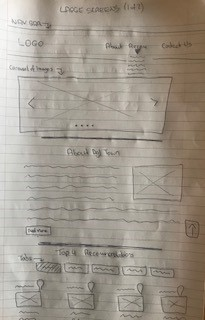
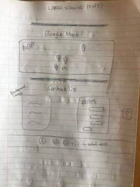
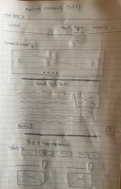
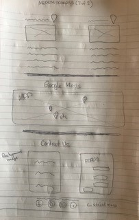
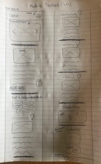

# Destination Donegal Town

# Contents
1. <a href="#Demo">Demo</a>
1. <a href="#UX">UX</a>
    * <a href="#UserStories">User Stories</a>
    * <a href="#Strategy">Strategy</a>
    * <a href="#Wireframes">Wireframes</a>
1. <a href="#Features">Features</a>
    * <a href="#FeaturesLeft">Possible Future Features</a>
1. <a href="#Technologies">Technologies</a>
1. <a href="#Testing">Testing</a>
1. <a href="#Deployment">Deployment</a>
    * <a href="#GitHubPages">GitHub Pages</a>
    * <a href="#ProjectLocally">To run this project locally</a>
1. <a href="#Credits">Credits</a>
    * <a href="#Content">Content</a>
    * <a href="#Media">Media</a>
    * <a href="#Acknowledgements">Acknowledgements</a>
1. <a href="#Disclaimer">Disclaimer</a>

<h2>Second Milestone Project: Interactive Frontend Development - Code Institute</h2>

This website will be a one page website which is a trend that's growing due to its functionality. 
This website is to promote Donegal Town as a holiday destination. It will focus on local knowledge 
of top recommendations for all budgets in relation to accomadation, things to do, places to eat and 
nightlife. The website will include a slideshow of images of Donegal Town, a write up of Donegal Town, 
top 4 recommendations for accomadation, kids activities, family activities, places to eat and nightlife, 
a google map to show where these recommendations are located, a contact form for any suggestions, 
queries or comments and social links on the footer.

<h1 id="Demo">1. Demo</h1>

A live demo can be found <a target="_blank" href="https://gareth1980.github.io/Destination-Donegal-Town/">here.</a>

<h1 id="UX">2. UX</h1>
<h2 id="UserStories">User Stories</h1>

I contacted 3 of my friends that have never been to Donegal Town and asked them what they 
would look for in a website about Donegal Town as a travel destination.

<h3>John and Mary from London</h3>

As a family of 4 kids under 10 years of age, we would be looking at making sure there is plenty
of kids and family activities to keep the kids entertained. Also where are these places situated by
way of google maps on our phones.

<h3>Simon and Joan from Cork</h3>

We are couple and what we look for is top quality hotels with nice restaurants and bars in the town. 
We always ask the locals when we visit new places for recommendations so to have a website that does 
that would be great.

<h3>Peter from Dublin</h3>

What I look for in a travel website is easy to navigate, possibly one page website, hate going from
one webpage to another searching for stuff. Want to see options for budget activities, places to places 
and a pub for a good pint and live music.

<h2 id="Strategy">Strategy</h2>

The overall strategy for visitors to this website is for them to come visit Donegal Town to boost the local economy 
and increase toursit numbers. My goal in the design of this website is to make it easy to use, easy on the eye and 
navigate by using a single page website.
As soon as you open the website you will see a carousel of images of Donegal Town which I find is eye catching 
as it presents the best of Donegal Town visually and will entice them to scroll down through the website. 
I designed the logo on <a target="_blank" href="https://www.freelogodesign.org/">www.freelogodesign.org</a> and 
chose a subtle green and yellow as these are the county colours of Donegal and the image of windy roads which are 
synonymous with Co Donegal. 
I used <a target="_blank" href="https://color.adobe.com/create/color-wheel/">www.color.adobe.com/create/color-wheel</a>
and selected the logo image and this website picked out distinct colours from the image and used only three of 
these colours consistently throughout the website so as not to overpower the website with too many colours. The 
colours selected were #718C0F, #D9B811 and #32590B which are mainly green and yellow. For the Contact Us section, I used 
<a target="_blank" href="https://www.rapidtables.com/convert/color/hex-to-rgb.html">www.rapidtables.com</a> to convert hex #718C0F 
to RGB colour in order to use transparency to see the background image. I have used <a target="_blank" 
href="https://fonts.google.com/">Google Fonts</a> to select the 2 different fonts used in the website. I chose 
Calligraffitti font for the 
main headings as it compliments the Logo font. I also chose Raleway font for the main scripting as it is a good pairing
with Calligraffitti font as per the google font website.

<h2 id="Wireframes">Wireframes</h2>

<h3>Wireframes for desktop devices</h3> 

<h3>Wireframes for tablet devices</h3> 

<h3>Wireframe for mobile devices</h3> 

<h1 id="Features">3. Features</h1>
<h2>Navbar</h2>
I have used a responsive navigation bar using bootstrap. On the left is the logo. 
For mobile devices a hamburger menu on the top-right expands a menu with links to 
the different section on the website. On larger devices the expanded menu is shown 
instead. I feel this will be easy for users to quickly navigate the website. This 
navbar will not be fixed as I feel it would take up to much of the screen especially 
for mobile devices. This is why I have put in the scroll to top button.

<h2>Scroll to Top Button</h2>
As the Navbar is not fixed, I have added a scroll to top button which will appear on
the bottom right of the screen as soon as scroll down through the website. Again, this
will make the website easy to use and navigate. 

<h2>Carousel of Images</h2>
This carousel of 4 images will be the first thing a visitor to the website will see. The
images show the best of Donegal Town visually and should entice them to scroll down through
the website. You can scroll through the pictures by either clicking the left and right
arrows or the markers at the bottom of the pictures. It will also automatically scroll 
through the pictures every 4 seconds approximately.

<h2>Read More/Less Button</h2>
I have written a number of paragraphs in the About Donegal Town section and have given the option 
to the website visitor to click the read more button if they want to continue reading more about
Donegal Town or else they can scroll down to the Top 5 Recommendations section. I have included 
this button as the website visitor would have to scroll through alot especially on a mobile device
if they didn't want to read through it.

<h2>Tab</h2>
I used the Tab feature for each of the the top 4 recommendations as the website would show far too much
information if all were showing. If the website visitor only wants to see places to eat, that's all that will
show, if website visitor wants to see nightlife, again that's all that will show, etc. Using the tab, tidies
up the website and will not clutter it.

<h2>Google Maps API</h2>
I used google maps API to show the website visitor all the recommendations using multiple markers on one map.
For each map marker, I have also included informations windows that includes a link to get more information 
and directions.

<h2>Contact Form and EmailJS</h2>
Included a contact form with 5 required fields (first name, last name, mobile number, email and query 
that when completed correctly will send an email to myself and an auto reply email
to the sender using <a target="_blank" href="https://www.emailjs.com/">EmailJS</a>. If one or more of
the fields are not completed correctly, website visitor will be advised.

<h2 id="FeaturesLeft">Possible Future Features</h2>
To add more towns with same idea of top recommendations from local knowledge by way of a dropdown menu 
for a list of towns. To add more than 4 recommendations for each category and maybe add a price scale for 
different budgets. Also when the contact form is completed, add a modal to confirm it was completed successfully.

<h1 id="Technologies">4. Technologies</h1>
<h2>Language Used</h2>

* <a target="_blank" href="https://en.wikipedia.org/wiki/HTML">HTML</a>
* <a target="_blank" href="https://en.wikipedia.org/wiki/Cascading_Style_Sheets">CSS</a>
* <a target="_blank" href="https://en.wikipedia.org/wiki/JavaScript">Javascript</a>

<h2>Frameworks, Libraries & Programs Used</h2>

* <a target="_blank" href="https://getbootstrap.com/docs/4.4/getting-started/introduction/">Bootstrap 4.4.1</a>
    * **Bootstrap** was used to assist with the responsiveness and styling of the navbar, carousel and the tabs.
* <a target="_blank" href="https://fonts.google.com/">Google Fonts</a>
    * **Google fonts** were used to import the Calligraffitti and Raleway font into the style.css file which is the 2 fonts used in the project.
* <a target="_blank" href="https://fontawesome.com/">Font Awesome</a>
    * **Font Awesome** was used to add icons for UX purposes. Icons specifically used for social icons in footer and contact us sections and for contcat details in the recommendations section..
* <a target="_blank" href="https://jquery.com/">jQuery</a>
    * The project uses **JQuery** to simplify DOM manipulation.
* <a target="_blank" href="https://developers.google.com/maps/documentation">Google Maps API</a>
    * The project uses the **Google Maps API** to integrate a map into the website.
* <a target="_blank" href="https://www.emailjs.com/">EmailJS</a>
    * When contact Us form completed correctly, **EmailJS** will email myself details of the completed contact from and also auto reply to the user.
* <a target="_blank" href="https://git-scm.com/">Git</a>
    * **Git** was used for version control by utilizing the Gitpod terminal to commit to Git and Push to GitHub.
* <a target="_blank" href="https://www.gitpod.io/">Gitpod</a>
    * **Gitpod** was the primary IDE used throughout the entirety of the project.
* <a target="_blank" href="https://github.com/">GitHub</a>
    * **GitHub** is used to store the project code after being pushed from Git.
    * The website is also deployed using GitHub Pages.
* <a target="_blank" href="https://htmlformatter.com/">HTML Formatter</a>
    * **HTML Formatter** was used to beautify code to keep the code neat and easy to read. It was utilised as Beautify Cmd (Shift + Alt + F) in GitPod distorted the code in GitHub.

<h1 id="Testing">5. Testing</h1>

............

<h1 id="Deployment">6. Deployment</h1>
<h2 id="GitHubPages">GitHub Pages</h2>

This project was developed using the Gitpod IDE. A repository was created on GitHub and regular commited 
to Git and pushed to GitHub.

To deploy to Github pages from its Github repository, the following steps need to be completed:

1. Log into Github.
1. Select the repository Gareth1980/Destination-Donegal-Town
1. Select Settings from the tab menu near the top
1. Scroll down to the GitHub pages section, second last section
1. Under Source, change on the drop-down menu from none to Master Branch
1. The page will refresh and you must scroll down to the Github pages section again, a message will 
appear saying "Your site is published at https://gareth1980.github.io/Destination-Donegal-Town/

<h2 id="ProjectLocally">To run this project locally</h2>
Clone this project from GitHub following the steps below:
1. Under the repository name, click "Clone or download" at the top right.
1. Copy the clone URL for the repository.
1. In your local IDE open your terminal and type: "git clone" , and paste the URL you copied in Step 2.
1. Now you will be able to open the project from your local IDE and see how it works.

<h1 id="Credits">7. Credits</h1>

<h2 id="Content">Content</h2>

All content in the Home Page was written by myself.............

<h2 id="Media">Media</h2>

...............

<h2 id="Acknowledgements">Acknowledgements</h2>

..........

<h1 id="Disclaimer">8. Disclaimer</h1>
The content and images on this website are for educational purposes only.